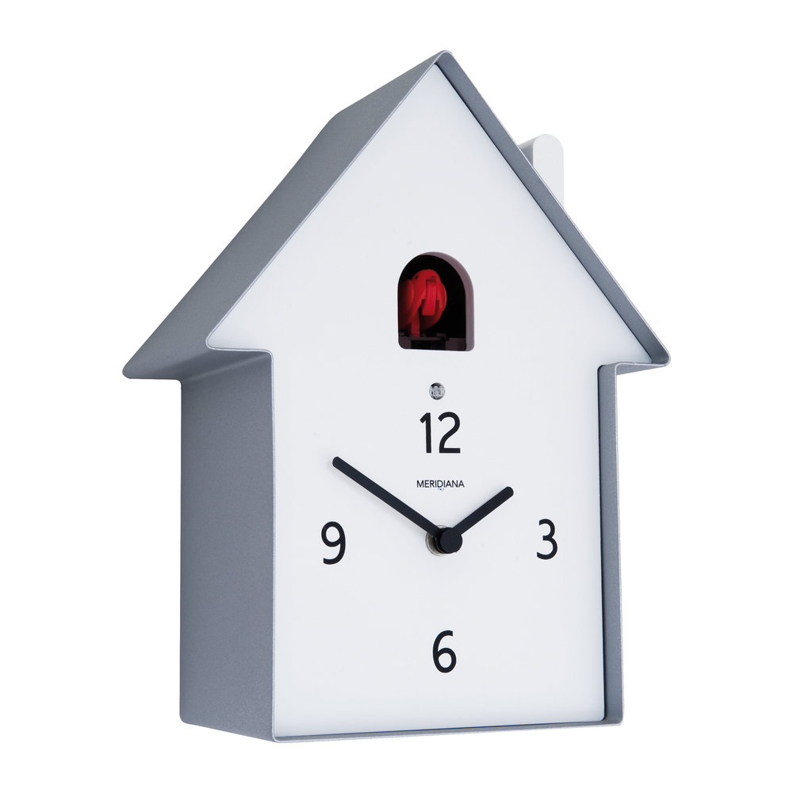

# cuckoo_clock_controller
A project to control the bird of a cuckoo clock

    

The goal is to create a energy efficient application that receives a schedule from google calendar and turns off the cuckoo at certain times.

### Hardware: ###
Adafruit Feather HUZZAH ESP8266 https://learn.adafruit.com/adafruit-feather-huzzah-esp8266/overview
Adafruit Latching Mini Relay FeatherWing https://learn.adafruit.com/mini-relay-featherwings/overview
Adafruit TPL5110 Low Power Timer Breakout https://learn.adafruit.com/adafruit-tpl5110-power-timer-breakout/
